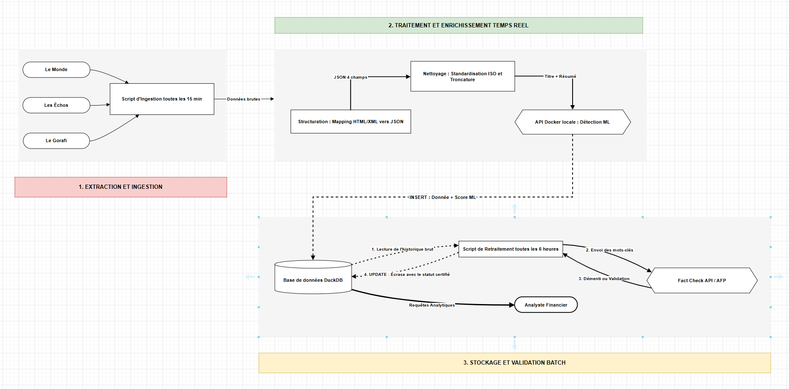

# Spécifications techniques et stratégie de développement (ETL) (rendu: 19/06/2026)

Le processus de développement du projet `info-filtre` est incrémental ; pour la première phase, il est conçu en mode "MVP selon les règles du 80-20" : je priorise ce qui apporte le plus de valeur rapidement, tout en posant des fondations solides.

## 1. Analyse des besoins des utilisateurs

### Sources de Données

- Le Monde (Généraliste/International): https://www.lemonde.fr/
- Le Figaro (Généraliste/International): https://www.lefigaro.fr/
- Fact Check AFP (Vérité/Vérification): https://factcheck.afp.com/
- Le Gorafi (Bruit/Satire): https://www.legorafi.fr/

### Les besoins des utilisateurs

L'objectif est d'alimenter un système d'aide à la décision pour anticiper l'évolution des marchés financiers. Le besoin strict est de fournir un flux d'actualités structuré, en temps réel, capable d'isoler la vérité des fake news. Le système doit ingérer la donnée en continu, tout en étant capable de recalculer toute la fiabilité de l'historique toutes les 6 heures pour.

## 2. Conception du pipeline de données

### Découverte (Ingestion)

`Méthode` : Web Scraping ciblé sur les pages d'accueil.
`Format d'origine` : Code source HTML brut.
`Fréquence de mise à jour` : Faire un scraping régulier toutes les 5 à 15 minutes pour simuler le flux "temps réel" sans surcharger les serveurs sources.

### Structuration (Mapping)

`Mapping` : Identification des sélecteurs (CSS/XPath) spécifiques à chaque site pour isoler les 4 champs cibles.

**Types de données requis (Schéma Cible):**

- `title` : Chaîne de caractères (String)
- `summary` : Chaîne de caractères courte (String)
- `event_date` : Date et Heure (Datetime)
- `publication_date` : Date et Heure (Datetime)

### Nettoyage (Transformations)

- `Transformations` : Suppression de toutes les balises HTML, scripts et publicités pour ne conserver que le texte brut du titre et du résumé.
- `Formatage des dates (Standardisation)` : Conversion de tous les formats temporels disparates (ex: "il y a 2h", "18/06/2026") vers le format strict demandé : YYYY-MM-DD HH:MM:SS (ex : 2026-02-11 19:00:00).
- `Troncature` : je vais potentiellement tronquer le champ summary à une limite stricte de mots (ex: 30 à 50 mots maximum) si la source fournit un texte trop long.

### Enrichissement (Temps Réel)

- `Détection ML en temps réel` : Concaténation du titre et du résumé, et envoi via requête HTTP (POST) au [module local de détection](https://github.com/josumsc/fake-news-detector).
- `Ajout du score` : Récupération de la probabilité (Fake/Real) et ajout dans la colonne ml_prediction
- `Stockage initial` : Écriture immédiate de la donnée enrichie dans la base DuckDB pour qu'elle soit consultable sans délai par les utilisateurs.

### Validation et Publication (Retraitement Batch - Toutes les 6h)

- `Extraction de l'historique` : Requête sur la base DuckDB pour récupérer toutes les actualités ingérées au cours des dernières heures.
- `Croisement Fact-Check` : Interrogation de la Google Fact Check Tools API (qui inclut l'AFP Factuel) à partir des titres de nos articles pour vérifier si un démenti officiel a été publié entre-temps.
- `Mise à jour et Certification (Match)` : * Si une correspondance est trouvée : le pipeline met à jour la ligne dans DuckDB (UPDATE), écrase la prédiction ML, et applique un tag définitif "Vrai" ou "Faux - Certifié AFP".
- `Si aucune correspondance n'est trouvée`  : le score ML initial est conservé.
  
**Publication** : La table DuckDB consolidée est exposée et prête à être connectée à l'outil de visualisation ou d'analyse des analystes financiers.

### Image de l'architecture du pipeline



## 3. Sélection des outils et des technologies

### Langage et Environnement

`Langage: Python`

**Pourquoi / Contexte**:Permet de tout faire (scraping, requêtes API, nettoyage) de la manière la plus concise possible.

Exemple : python main_pipeline.py

`Gestionnaire de dépendances: uv`

**Pourquoi / Contexte**: Écrit en Rust, il remplace pip et virtualenv. C'est le gestionnaire le plus rapide de l'écosystème actuel. Pour cet MVP , il réduit drastiquement les temps d'installation.

Exemple:

```bash
uv init
uv pip install requests beautifulsoup4 pandas duckdb schedule
```

### Extraction et Ingestion

`Client HTTP: requests`

**Pourquoi / Contexte:** Outil standard et léger pour interroger les flux RSS (Le Monde, Les Échos) de manière fiable sans la lourdeur d'un framework asynchrone pour ce petit volume de données.

Exemple:

```python
import requests
reponse = requests.get("https://www.lemonde.fr/rss/une.xml")
contenu_xml = reponse.text
```

`Parsing / Scraping : BeautifulSoup4`

**Pourquoi / Contexte:** Parfait pour parser les balises XML des flux RSS ou extraire des textes d'une page HTML brute. C'est robuste et ça évite de faire tourner un navigateur en arrière-plan (exit Selenium).

Exemple:

```python
from bs4 import BeautifulSoup
soup = BeautifulSoup(contenu_xml, 'xml')
titres = [item.title.text for item in soup.find_all('item')]
```

### Traitement et Enrichissement

`Manipulation et Nettoyage: pandas`

**Pourquoi / Contexte:** Bien que ce soit une bibliothèque puissante, elle est justifiée ici pour sa capacité à standardiser des formats de dates et pour son intégration magique avec DuckDB. Gain de temps de développement massif pour le MVP.

Exemple:

```python
import pandas as pd
df = pd.DataFrame(donnees_scrapees)
# Standardisation ISO des dates en une ligne
df['event_date'] = pd.to_datetime(df['event_date']).dt.strftime('%Y-%m-%d %H:%M:%S')
```

`Communication ML: requests (En mode POST)`

**Pourquoi / Contexte:** Le modèle ML tourne localement dans un conteneur Docker (API Flask). Un simple appel HTTP POST suffit pour lui envoyer le texte et récupérer la prédiction instantanément.

Exemple:

```python
payload = {"text": "Titre et résumé de l'article"}
reponse_ml = requests.post("http://localhost:5001/detect_json", json=payload)
score = reponse_ml.json().get('score')
```

### Stockage

`Base de données analytique: DuckDB`

**Pourquoi / Contexte:** Idéal pour un MVP. Aucune configuration de serveur requise, tout tient dans un simple fichier local. De plus, il lit directement les DataFrames Pandas en mémoire pour faire des insertions massives (bulk inserts).

Exemple:

```python
import duckdb
# Connexion au fichier local (créé automatiquement)
con = duckdb.connect('news_database.db')

# Insertion magique et directe depuis le DataFrame Pandas
con.execute("CREATE TABLE IF NOT EXISTS articles AS SELECT * FROM df")
```

### Orchestration

`Planificateur Python : schedule`
**Pourquoi / Contexte** : Pour éviter la complexité de création de graphes (DAGs) sous Dagster ou Airflow, et pour s'affranchir des configurations système comme cron. Cet outil permet de tout garder au sein du code Python avec une syntaxe extrêmement lisible.

Exemple:

```python
import schedule
import time
from ingestion import run_realtime_ingestion
from validation import run_validation_batch

# Planification claire et lisible qui marchera bien pour ce MVP

schedule.every(15).minutes.do(run_realtime_ingestion)
schedule.every(6).hours.do(run_validation_batch)

print("Lancement de l'orchestrateur du pipeline...")
while True:
    schedule.run_pending()
    time.sleep(1)
```

## 4. Configuration du pipeline

### structure du projet

```python
info-filtre/
├── data/                  # Stockage local
│   └── pipeline.db        # Fichier DuckDB
├── src/
│   ├── __init__.py
│   ├── extract/           # Récupération des données brutes
│   │   ├── __init__.py
│   │   └── rss_scraper.py # Appels HTTP avec 'requests' et 'BeautifulSoup'
│   ├── transform/         # Nettoyage et Enrichissement
│   │   ├── __init__.py
│   │   └── cleaner.py     # Nettoyage Pandas et requêtes API vers le modèle ML
│   ├── load/              # Interactions avec la base de données
│   │   ├── __init__.py
│   │   └── duckdb_client.py # Fonctions d'insertion et d'extraction DuckDB
│   ├── validation/        # Logique métier du batch de 6 heures
│   │   ├── __init__.py
│   │   └── fact_checker.py  # Croisement avec la Fact Check AFP
│   └── main_pipeline.py   # L'orchestrateur utilisant 'schedule'
├── config/
│   └── sources.json       # Liste des URL (RSS Le Monde, Les Echos, etc.)
├── tests/                 # Dossier pour tes futurs tests unitaires
│   └── __init__.py
├── .env.example           # Template des variables d'environnement
├── .gitignore             # Fichiers à ignorer
├── pyproject.toml         # Fichier de dépendances (généré par 'uv')
└── README.md              # Documentation de ton projet
```

### Lancement du Modèle ML (Docker)

Le pipeline s'appuie sur un modèle de Machine Learning local (DistilBERT) pour évaluer la fiabilité des articles en temps réel. Ce modèle est packagé sous forme d'API Flask dans un conteneur Docker.

**Télécharger l'image ML :**

```bash
   docker pull josumsc/flask-fake-news
```

**Lancer le conteneur (en exposant le port 5001) :**

```bash
    docker run -d -p 5001:5000 josumsc/flask-fake-news
```

### Installation des dépendances Python

```bash
    uv init
```

```bash
    uv pip install requests beautifulsoup4 pandas duckdb schedule lxml python-dotenv
```
